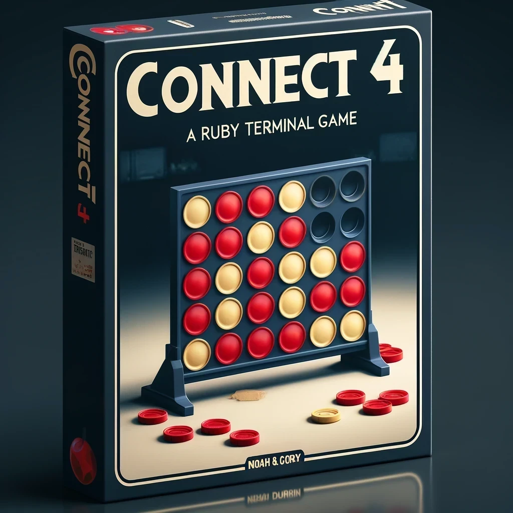

# connect_four

## 1. This project did not provide an interaction pattern. How did you approach the design and problem solving process for this project?

Once we individually read through and understood the project requirements, we did a collaborative brain storming session, mapping out our ideas on a muro board. We had a full vision of where we were headed before starting to code, making note to remain flexible as more discovery as we got into the project was inevitable. 

## 2. If you had one more day to work on this project, what would you work on?

We would work on discovering edge case scenarios, refactoring some of the longer methods using the built in class Range, isolating the prompts for user input to allow for more unit and functional testing.

## 3. Describe the pairing techniques you used while working on this project.

Initially we spent most of the time using a driver/navigator approach, both taking turns with each responsibility. 

## 4. Describe how feedback was shared over the course of this project.

We were in constant communication throughout the entire project, and conducted an informal check-in on process, communication, and next steps. During this check-in we made a pointed effort to open the floor for feedback. We quickly found a working rhythm where feedback was freely given as needed.

## link to DTR:
  https://docs.google.com/document/d/1eF9KqJ6Kxt8uTXtj6caAE9FfoCT54UutNXx94pypL_w/edit

  
